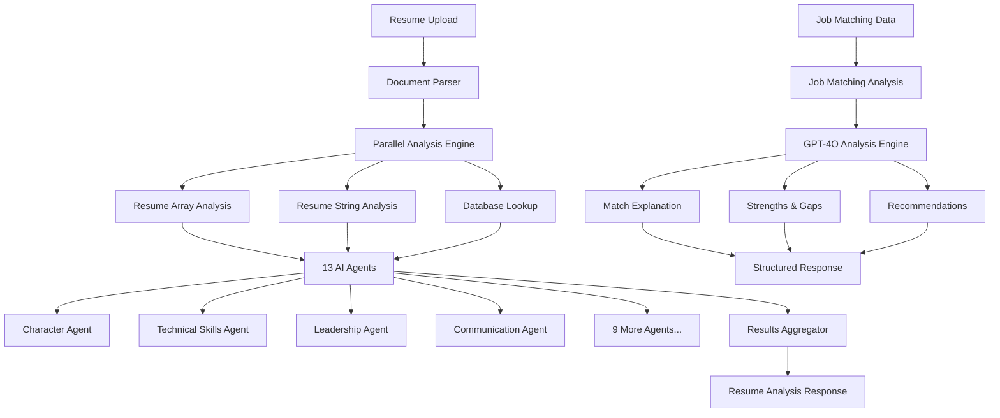

# MPower AI - Intelligent Resume Analysis & Job Matching API

[](https://fastapi.tiangolo.com)
[](https://python.org)
[](https://openai.com)

## 🚀 Overview

MPower AI is an advanced AI-powered platform that combines intelligent resume analysis with sophisticated job matching capabilities. The system analyzes uploaded resumes, generates detailed skill profiles across 13 different categories, and provides comprehensive job matching explanations using OpenAI's GPT-4O model.

### 🎯 Key Features

- **Intelligent Resume Parsing** - Extract structured data from PDF, DOC, DOCX, and TXT files
- **Multi-Dimensional Analysis** - Evaluate 13 skill categories including soft skills, technical skills, and professional attributes
- **AI-Powered Job Matching** - Detailed analysis and explanation of job compatibility with candidate profiles
- **Matching Algorithm Insights** - Transparent breakdown of how match percentages are calculated
- **Parallel Processing** - High-performance concurrent analysis for optimal speed
- **Database Integration** - SQL Server backend with comprehensive lookup tables
- **RESTful API** - Clean, documented FastAPI endpoints with Pydantic validation
- **Real-time Processing** - Asynchronous operations for scalable performance

## 🏗️ Architecture



## 📊 Skill Categories Analyzed

| Category | Description | Example Traits |
|----------|-------------|----------------|
| **Character** | Professional integrity and ethics | Accountability, Reliability, Trustworthiness |
| **Communication** | Verbal and written communication abilities | Public Speaking, Written Communication, Presentation |
| **Leadership** | Management and leadership capabilities | Team Management, Decision Making, Project Management |
| **Technical Skills** | Programming and technical expertise | AI/ML, Cloud Computing, Programming Languages |
| **Creativity** | Innovation and creative thinking | Innovation, Creative Thinking, Experimentation |
| **Collaboration** | Teamwork and interpersonal skills | Team Building, Cooperation, Remote Team Experience |
| **Critical Thinking** | Analytical and problem-solving skills | Problem Solving, Research, Analytical Thinking |
| **Metacognition** | Self-awareness and learning abilities | Planning, Goal Setting, Adaptability |
| **Growth Mindset** | Learning orientation and adaptability | Self-starter, Curiosity, Results Focused |
| **Mindfulness** | Emotional intelligence and awareness | Empathy, Emotional Intelligence, Cultural Sensitivity |
| **Fortitude** | Resilience and determination | Resilience, Tenacity, Calmness Under Pressure |
| **Industry** | Professional domain classification | Technology, Healthcare, Finance, etc. |
| **Education Level** | Academic qualification assessment | Bachelor's, Master's, PhD, Certifications |

## 🎯 Job Matching Algorithm

The AI-powered job matching system uses a weighted algorithm to calculate compatibility scores:

| Component | Weight | Description |
|-----------|--------|-------------|
| **Required Skills** | 30% | Job's required skills vs candidate's technical & soft skills |
| **Preferred Skills** | 15% | Job's preferred skills vs candidate's technical & other skills |
| **Other Skills** | 10% | Additional skill matching between job requirements and candidate |
| **Qualifications** | 15% | Educational background and experience alignment |
| **Responsibilities** | 15% | Job responsibilities vs candidate's experience |
| **Industry** | 5% | Industry experience match |
| **Role** | 5% | Job title/role alignment |
| **Location** | 5% | Geographic compatibility |

### AI Analysis Features

- **Detailed Explanations**: Comprehensive breakdown of match reasoning
- **Strength Identification**: Highlights candidate's competitive advantages
- **Gap Analysis**: Identifies areas for improvement
- **Actionable Recommendations**: Specific steps to improve match scores
- **Transferable Skills Recognition**: Identifies cross-domain skill applications

## 🛠️ Installation

### Prerequisites

- Python 3.10+
- SQL Server Database
- OpenAI API Key

### Quick Start

1. **Clone the repository**
   ```bash
   git clone https://github.com/your-repo/mpower-ai.git
   cd mpower-ai
   ```

2. **Create virtual environment**
   ```bash
   python -m venv env
   source env/bin/activate  # On Windows: env\Scripts\activate
   ```

3. **Install dependencies**
   ```bash
   pip install -r requirements.txt
   ```

4. **Configure environment variables**
   ```bash
   # Create .env file
   OPENAI_API_KEY=your_openai_api_key_here
   DATABASE_CONNECTION_STRING=your_sql_server_connection
   ```

5. **Set up database**
   ```bash
   # Run the SQL scripts in logic/databse.sql to create lookup tables
   ```

6. **Start the server**
   ```bash
   uvicorn app:app --reload --host 0.0.0.0 --port 8001
   ```

## 📚 API Documentation

### Base URL
```
http://localhost:8001
```

### Endpoints

#### 🏠 Root Endpoint
```http
GET /
```
Returns basic API information and available endpoints.

**Response:**
```json
{
  "message": "Welcome to MPower AI API",
  "version": "1.0.0",
  "docs": "/docs",
  "endpoints": {
    "health": "/health",
    "improvement_profile": "/improvement-profile",
    "job_matching_explanation": "/job-matching-explanation"
  }
}
```

#### 💊 Health Check
```http
GET /health
```
Checks API health status.

**Response:**
```json
{
  "status": "healthy",
  "timestamp": "2024-01-20T10:30:45.123456",
  "service": "Resume Maker API"
}
```

#### 🎯 Resume Analysis (Main Endpoint)
```http
POST /improvement-profile
```

**Request:**
- **Content-Type:** `multipart/form-data`
- **File Parameter:** `resume_file` (PDF, DOC, DOCX, TXT)

**Example using cURL:**
```bash
curl -X POST "http://localhost:8001/improvement-profile" \
  -H "accept: application/json" \
  -H "Content-Type: multipart/form-data" \
  -F "resume_file=@your_resume.pdf"
```

**Example using Python:**
```python
import requests

url = "http://localhost:8001/improvement-profile"
files = {"resume_file": open("resume.pdf", "rb")}
response = requests.post(url, files=files)
result = response.json()
```

**Response Structure:**
```json
{
  "status_code": 200,
  "status": "success",
  "message": "Comprehensive resume analysis completed successfully",
  "processed_results": {
    "character": [5, 6],
    "collaboration": [2, 3, 7],
    "creativity": [1, 2],
    "growthmindset": [1, 2, 3, 6],
    "mindfulness": [6],
    "technicalskills": [1, 3, 8, 9, 16, 27, 28, 29, 43, 52, 55],
    "industry": [1],
    "educationlevel": [4],
    "communication": [2],
    "leadership": [5, 4],
    "metacognition": [6, 7],
    "criticalthinking": [1, 5, 7],
    "fortitude": [1, 4]
  },
  "string_data": {
    "headline": "AI/ML Engineer",
    "memberFirstName": "Jayanta",
    "memberLastName": "Roy",
    "experience": [...],
    "education": [...],
    "otherSkillName": [...]
  },
  "total_tokens": 14926
}
```

#### 🎯 Job Matching Explanation
```http
POST /job-matching-explanation
```

Analyzes job compatibility between a candidate profile and job posting, providing detailed explanations, strengths, gaps, and recommendations.

**Request:**
- **Content-Type:** `application/json`
- **Body:** Complete job matching data structure

**Request Structure:**
```json
{
  "status": "success",
  "data": {
    "Matching_Percentage": 89,
    "member": {
      "MemberId": 43,
      "MemberFirstName": "Sidharth",
      "MemberLastName": "Parwanda",
      "Headline": "Software Engineer",
      "TechnicalSkillNames": "Java; Python; JavaScript; SQL; Cloud Services",
      "OtherSkills": "HTTP protocols, RESTful APIs, microservices",
      "Experience": "4+ years experience as a software engineer...",
      "Education": "Bachelor's in Computer Science...",
      "CommunicationNames": "Technical Communication; Code Review",
      "LeadershipNames": "Technical Leadership; Project Management",
      "CriticalThinkingNames": "Problem Solving; Analytical Thinking",
      "CollaborationNames": "Teamwork; Cross-functional Collaboration",
      "CharacterNames": "Accountability; Reliability",
      "CreativityNames": "Innovation; Creative Problem Solving",
      "GrowthMindsetNames": "Self-starter; Action-Oriented",
      "CityName": "California"
    },
    "jobpost": {
      "Id": 22,
      "JobTitle": "Marketing Manager",
      "Required_Skills": "Proficiency in social media platforms...",
      "PreferredSkills": "Experience with graphic design tools...",
      "Qualifications": "Bachelor's degree in Marketing...",
      "Key_Responsibilities": "Develop and implement social media strategies...",
      "Industry": "Marketing",
      "Role": "Marketing Manager",
      "JobLocation": "Indianapolis"
    }
  }
}
```

**Example using cURL:**
```bash
curl -X POST "http://localhost:8001/job-matching-explanation" \
  -H "accept: application/json" \
  -H "Content-Type: application/json" \
  -d '{
    "status": "success",
    "data": {
      "Matching_Percentage": 89,
      "member": { ... },
      "jobpost": { ... }
    }
  }'
```

**Example using Python:**
```python
import requests
import json

url = "http://localhost:8001/job-matching-explanation"
data = {
    "status": "success", 
    "data": {
        "Matching_Percentage": 89,
        "member": { ... },
        "jobpost": { ... }
    }
}

response = requests.post(url, json=data)
result = response.json()
```

**Response Structure:**
```json
{
  "status": "success",
  "analysis": {
    "match_explanation": "Your profile received an 89% match score for this Marketing Manager position primarily due to strong transferable skills in communication, leadership, and project management. While your technical background in software engineering differs from the marketing domain, your experience with cross-functional collaboration, technical communication, and analytical thinking aligns well with the strategic aspects of this role...",
    "strengths": [
      "Strong leadership and project management experience",
      "Excellent technical communication skills",
      "Proven analytical and problem-solving abilities",
      "Experience with cross-functional team collaboration",
      "Self-starter mentality and action-oriented approach"
    ],
    "gaps": [
      "No direct social media marketing experience",
      "Missing marketing-specific qualifications",
      "Limited experience with marketing tools (Hootsuite, Buffer)",
      "No background in SEO, PPC, or content marketing",
      "Lack of creative design skills"
    ],
    "recommendations": [
      "Obtain certifications in digital marketing or social media marketing",
      "Learn popular social media management tools like Hootsuite or Buffer",
      "Take courses in SEO, PPC, and content marketing fundamentals",
      "Build a portfolio showcasing any marketing projects or content creation",
      "Highlight transferable analytical skills for marketing metrics analysis"
    ]
  },
  "tokens_used": 1234
}
```

## 🔧 Configuration

### Environment Variables

| Variable | Description | Required |
|----------|-------------|----------|
| `OPENAI_API_KEY` | OpenAI API key for GPT-4O access | ✅ |
| `DATABASE_CONNECTION_STRING` | SQL Server connection string | ✅ |

### Database Setup

The application requires SQL Server with the following lookup tables:

```sql
-- Core lookup tables
Industry (Id, IndustryName)
EducationLevel (Id, EducationLevelName)
Communication (Id, CommunicationName)
Leadership (Id, LeadershipName)
Metacognition (Id, MetacognitionName)
CriticalThinking (Id, CriticalThinkingName)
Collaboration (Id, CollaborationName)
Character (Id, CharacterName)
Creativity (Id, CreativityName)
GrowthMindset (Id, GrowthMindsetName)
Mindfulness (Id, MindfulnessName)
Fortitude (Id, FortitudeName)
TechnicalSkills (Id, TechnicalSkillsName)
```

## 🚀 Performance Features

### Parallel Processing Architecture

The system implements two levels of parallel processing:

1. **Level 1: Core Operations (3 concurrent processes)**
   - Resume array analysis
   - Resume string analysis  
   - Database lookup fetching

2. **Level 2: AI Agent Analysis (13 concurrent processes)**
   - All skill category agents run simultaneously
   - Optimized for maximum throughput
   - Reduced API latency

### Performance Benefits

- **13x faster processing** compared to sequential analysis
- **Concurrent API calls** to OpenAI
- **Optimized resource utilization**
- **Scalable architecture** for high-volume processing

## 🏗️ Project Structure

```
MPower/
├── app.py                      # FastAPI application entry point
├── process.py                  # Main processing pipeline
├── shared_client.py            # Shared OpenAI client configuration
├── requirements.txt            # Python dependencies
├── job_maching_explation/      # Job matching analysis module
│   ├── job_percentage_explain.py   # AI-powered job matching analysis
│   └── json_data_fech.py           # Data fetching utilities
├── scraper/                    # Document processing modules
│   ├── document_scraper.py     # File parsing utilities
│   ├── resume_scraper_array_agent.py
│   ├── resume_scraper_string_agent.py
│   └── databse_scraper_agent.py
├── McpAgent/                   # AI analysis agents (13 specialized agents)
│   ├── character_agent.py
│   ├── communication_agent.py
│   ├── leadership_agent.py
│   ├── technicalskills_agent.py
│   ├── collaboration_agent.py
│   ├── creativity_agent.py
│   ├── criticalthinking_agent.py
│   ├── educationlevel_agent.py
│   ├── fortitude_agent.py
│   ├── growthmindset_agent.py
│   ├── industry_agent.py
│   ├── metacognition_agent.py
│   └── mindfulness_agent.py
├── logic/                      # Business logic and SQL
│   ├── databse.sql            # Database schema
│   ├── database.json          # Database lookup data
│   ├── my_data_tables.json    # Additional data tables
│   └── out_responce.json      # Sample responses
└── uploads/                    # Temporary file storage
```

## 🔍 Understanding the Response

### Processed Results
The `processed_results` object contains arrays of matching trait IDs for each skill category:

```json
{
  "technicalskills": [1, 3, 9, 43, 55]
}
```

This means the candidate matches:
- ID 1: "Artificial Intelligence"
- ID 3: "Cloud Computing"  
- ID 9: "Machine Learning"
- ID 43: "Python Programming"
- ID 55: "AWS"

### String Data
Contains structured resume information:
- Personal details (name, headline)
- Work experience with descriptions
- Education background
- Categorized skill lists

## 🛡️ Error Handling

The API implements comprehensive error handling:

| Error Code | Description | Response |
|------------|-------------|----------|
| 400 | Invalid file type | File format not supported |
| 500 | Processing error | Internal server error with details |
| 422 | Validation error | Request validation failed |

## 📊 Monitoring & Analytics

- **Token Usage Tracking**: Monitor OpenAI API consumption
- **Processing Time Metrics**: Track analysis performance
- **Error Rate Monitoring**: Identify and resolve issues
- **File Upload Statistics**: Usage analytics

## 🤝 Contributing

1. Fork the repository
2. Create a feature branch (`git checkout -b feature/amazing-feature`)
3. Commit your changes (`git commit -m 'Add amazing feature'`)
4. Push to the branch (`git push origin feature/amazing-feature`)
5. Open a Pull Request

## 📄 License

This project is licensed under the MPower License - see the [LICENSE](LICENSE) file for details.

## 🆘 Support

For support and questions:

- 📧 Email: jayantaeslova@gmail.com
- 📖 Documentation: `/docs` endpoint
- 🐛 Issues: GitHub Issues page

## 🔮 Roadmap

- [ ] Multi-language support
- [ ] Real-time collaboration features
- [ ] Advanced analytics dashboard
- [ ] Integration with job boards
- [ ] Mobile application support
- [ ] Batch processing capabilities

---

**Built with ❤️ using FastAPI, OpenAI GPT-4O, and modern AI technologies.**
