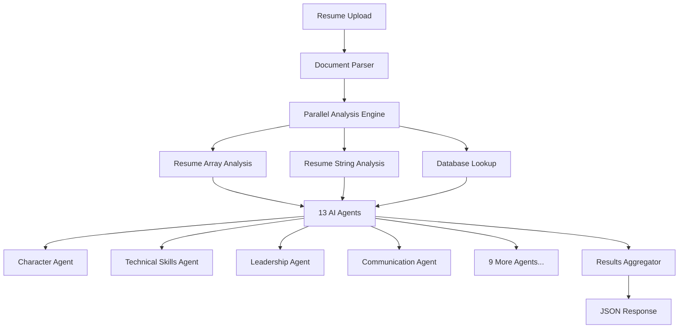

# MPower AI - Intelligent Resume Analysis API

[](https://fastapi.tiangolo.com)
[](https://python.org)
[](https://openai.com)
[](LICENSE)

## 🚀 Overview

MPower AI is an advanced resume analysis platform that leverages artificial intelligence to provide comprehensive skill assessments and career insights. The system analyzes uploaded resumes and generates detailed profiles across 13 different skill categories using OpenAI's GPT-4O model.

### 🎯 Key Features

- **Intelligent Resume Parsing** - Extract structured data from PDF, DOC, DOCX, and TXT files
- **Multi-Dimensional Analysis** - Evaluate 13 skill categories including soft skills, technical skills, and professional attributes
- **Parallel Processing** - High-performance concurrent analysis for optimal speed
- **Database Integration** - SQL Server backend with comprehensive lookup tables
- **RESTful API** - Clean, documented FastAPI endpoints
- **Real-time Processing** - Asynchronous operations for scalable performance

## 🏗️ Architecture



## 📊 Skill Categories Analyzed

| Category | Description | Example Traits |
|----------|-------------|----------------|
| **Character** | Professional integrity and ethics | Accountability, Reliability, Trustworthiness |
| **Communication** | Verbal and written communication abilities | Public Speaking, Written Communication, Presentation |
| **Leadership** | Management and leadership capabilities | Team Management, Decision Making, Project Management |
| **Technical Skills** | Programming and technical expertise | AI/ML, Cloud Computing, Programming Languages |
| **Creativity** | Innovation and creative thinking | Innovation, Creative Thinking, Experimentation |
| **Collaboration** | Teamwork and interpersonal skills | Team Building, Cooperation, Remote Team Experience |
| **Critical Thinking** | Analytical and problem-solving skills | Problem Solving, Research, Analytical Thinking |
| **Metacognition** | Self-awareness and learning abilities | Planning, Goal Setting, Adaptability |
| **Growth Mindset** | Learning orientation and adaptability | Self-starter, Curiosity, Results Focused |
| **Mindfulness** | Emotional intelligence and awareness | Empathy, Emotional Intelligence, Cultural Sensitivity |
| **Fortitude** | Resilience and determination | Resilience, Tenacity, Calmness Under Pressure |
| **Industry** | Professional domain classification | Technology, Healthcare, Finance, etc. |
| **Education Level** | Academic qualification assessment | Bachelor's, Master's, PhD, Certifications |

## 🛠️ Installation

### Prerequisites

- Python 3.10+
- SQL Server Database
- OpenAI API Key

### Quick Start

1. **Clone the repository**
   ```bash
   git clone https://github.com/your-repo/mpower-ai.git
   cd mpower-ai
   ```

2. **Create virtual environment**
   ```bash
   python -m venv env
   source env/bin/activate  # On Windows: env\Scripts\activate
   ```

3. **Install dependencies**
   ```bash
   pip install -r requirements.txt
   ```

4. **Configure environment variables**
   ```bash
   # Create .env file
   OPENAI_API_KEY=your_openai_api_key_here
   DATABASE_CONNECTION_STRING=your_sql_server_connection
   ```

5. **Set up database**
   ```bash
   # Run the SQL scripts in logic/databse.sql to create lookup tables
   ```

6. **Start the server**
   ```bash
   uvicorn app:app --reload --host 0.0.0.0 --port 8000
   ```

## 📚 API Documentation

### Base URL
```
http://localhost:8000
```

### Endpoints

#### 🏠 Root Endpoint
```http
GET /
```
Returns basic API information and available endpoints.

**Response:**
```json
{
  "message": "Welcome to MPower AI API",
  "version": "1.0.0",
  "docs": "/docs",
  "endpoints": {
    "health": "/health",
    "improvement_profile": "/improvement-profile"
  }
}
```

#### 💊 Health Check
```http
GET /health
```
Checks API health status.

**Response:**
```json
{
  "status": "healthy",
  "timestamp": "2024-01-20T10:30:45.123456",
  "service": "Resume Maker API"
}
```

#### 🎯 Resume Analysis (Main Endpoint)
```http
POST /improvement-profile
```

**Request:**
- **Content-Type:** `multipart/form-data`
- **File Parameter:** `resume_file` (PDF, DOC, DOCX, TXT)

**Example using cURL:**
```bash
curl -X POST "http://localhost:8000/improvement-profile" \
  -H "accept: application/json" \
  -H "Content-Type: multipart/form-data" \
  -F "resume_file=@your_resume.pdf"
```

**Example using Python:**
```python
import requests

url = "http://localhost:8000/improvement-profile"
files = {"resume_file": open("resume.pdf", "rb")}
response = requests.post(url, files=files)
result = response.json()
```

**Response Structure:**
```json
{
  "status_code": 200,
  "status": "success",
  "message": "Comprehensive resume analysis completed successfully",
  "processed_results": {
    "character": [5, 6],
    "collaboration": [2, 3, 7],
    "creativity": [1, 2],
    "growthmindset": [1, 2, 3, 6],
    "mindfulness": [6],
    "technicalskills": [1, 3, 8, 9, 16, 27, 28, 29, 43, 52, 55],
    "industry": [1],
    "educationlevel": [4],
    "communication": [2],
    "leadership": [5, 4],
    "metacognition": [6, 7],
    "criticalthinking": [1, 5, 7],
    "fortitude": [1, 4]
  },
  "string_data": {
    "headline": "AI/ML Engineer",
    "memberFirstName": "Jayanta",
    "memberLastName": "Roy",
    "experience": [...],
    "education": [...],
    "otherSkillName": [...]
  },
  "total_tokens": 14926
}
```

## 🔧 Configuration

### Environment Variables

| Variable | Description | Required |
|----------|-------------|----------|
| `OPENAI_API_KEY` | OpenAI API key for GPT-4O access | ✅ |
| `DATABASE_CONNECTION_STRING` | SQL Server connection string | ✅ |

### Database Setup

The application requires SQL Server with the following lookup tables:

```sql
-- Core lookup tables
Industry (Id, IndustryName)
EducationLevel (Id, EducationLevelName)
Communication (Id, CommunicationName)
Leadership (Id, LeadershipName)
Metacognition (Id, MetacognitionName)
CriticalThinking (Id, CriticalThinkingName)
Collaboration (Id, CollaborationName)
Character (Id, CharacterName)
Creativity (Id, CreativityName)
GrowthMindset (Id, GrowthMindsetName)
Mindfulness (Id, MindfulnessName)
Fortitude (Id, FortitudeName)
TechnicalSkills (Id, TechnicalSkillsName)
```

## 🚀 Performance Features

### Parallel Processing Architecture

The system implements two levels of parallel processing:

1. **Level 1: Core Operations (3 concurrent processes)**
   - Resume array analysis
   - Resume string analysis  
   - Database lookup fetching

2. **Level 2: AI Agent Analysis (13 concurrent processes)**
   - All skill category agents run simultaneously
   - Optimized for maximum throughput
   - Reduced API latency

### Performance Benefits

- **13x faster processing** compared to sequential analysis
- **Concurrent API calls** to OpenAI
- **Optimized resource utilization**
- **Scalable architecture** for high-volume processing

## 🏗️ Project Structure

```
MPower/
├── app.py                      # FastAPI application entry point
├── process.py                  # Main processing pipeline
├── requirements.txt            # Python dependencies
├── lookup_tables.json          # Static lookup data
├── scraper/                    # Document processing modules
│   ├── document_scraper.py     # File parsing utilities
│   ├── resume_scraper_array_agent.py
│   ├── resume_scraper_string_agent.py
│   └── databse_scraper_agent.py
├── McpAgent/                   # AI analysis agents
│   ├── character_agent.py
│   ├── communication_agent.py
│   ├── leadership_agent.py
│   ├── technicalskills_agent.py
│   └── [9 more agents...]
└── logic/                      # Business logic and SQL
    ├── databse.sql            # Database schema
    └── out_responce.json      # Sample responses
```

## 🔍 Understanding the Response

### Processed Results
The `processed_results` object contains arrays of matching trait IDs for each skill category:

```json
{
  "technicalskills": [1, 3, 9, 43, 55]
}
```

This means the candidate matches:
- ID 1: "Artificial Intelligence"
- ID 3: "Cloud Computing"  
- ID 9: "Machine Learning"
- ID 43: "Python Programming"
- ID 55: "AWS"

### String Data
Contains structured resume information:
- Personal details (name, headline)
- Work experience with descriptions
- Education background
- Categorized skill lists

## 🛡️ Error Handling

The API implements comprehensive error handling:

| Error Code | Description | Response |
|------------|-------------|----------|
| 400 | Invalid file type | File format not supported |
| 500 | Processing error | Internal server error with details |
| 422 | Validation error | Request validation failed |

## 📊 Monitoring & Analytics

- **Token Usage Tracking**: Monitor OpenAI API consumption
- **Processing Time Metrics**: Track analysis performance
- **Error Rate Monitoring**: Identify and resolve issues
- **File Upload Statistics**: Usage analytics

## 🤝 Contributing

1. Fork the repository
2. Create a feature branch (`git checkout -b feature/amazing-feature`)
3. Commit your changes (`git commit -m 'Add amazing feature'`)
4. Push to the branch (`git push origin feature/amazing-feature`)
5. Open a Pull Request

## 📄 License

This project is licensed under the MPower License - see the [LICENSE](LICENSE) file for details.

## 🆘 Support

For support and questions:

- 📧 Email: support@mpower-ai.com
- 📖 Documentation: `/docs` endpoint
- 🐛 Issues: GitHub Issues page

## 🔮 Roadmap

- [ ] Multi-language support
- [ ] Real-time collaboration features
- [ ] Advanced analytics dashboard
- [ ] Integration with job boards
- [ ] Mobile application support
- [ ] Batch processing capabilities

---

**Built with ❤️ using FastAPI, OpenAI GPT-4O, and modern AI technologies.**
